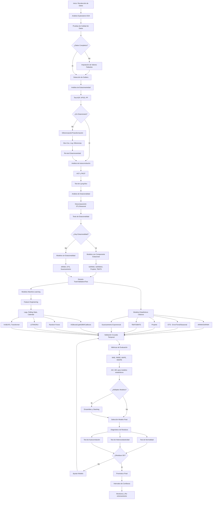

```mermaid
graph TD
    A[Inicio: Recolección de Datos] --> B[Análisis Exploratorio EDA]
    B --> C[Pruebas de Calidad de Datos]
    C --> D{¿Datos Completos?}
    D -->|No| E[Imputación de Valores Faltantes]
    E --> F[Detección de Outliers]
    D -->|Sí| F
    F --> G[Análisis de Estacionariedad]
    G --> H[Test ADF, KPSS, PP]
    H --> I{¿Es Estacionaria?}
    I -->|No| J[Diferenciación/Transformación]
    J --> K[Box-Cox, Log, Diferencias]
    K --> L[Re-test Estacionariedad]
    I -->|Sí| M[Análisis de Autocorrelación]
    L --> M
    M --> N[ACF y PACF]
    N --> O[Test de Ljung-Box]
    O --> P[Análisis de Estacionalidad]
    P --> Q[Descomposición STL/Seasonal]
    Q --> R[Tests de Estacionalidad]
    R --> S{¿Hay Estacionalidad?}
    S -->|Sí| T[Modelos con Componente Estacional]
    S -->|No| U[Modelos sin Estacionalidad]
    T --> V[SARIMA, SARIMAX, Prophet, TBATS]
    U --> W[ARIMA, ETS, Suavizamiento]
    V --> X[División Train/Validation/Test]
    W --> X
    X --> Y[Modelos Estadísticos Clásicos]
    X --> Z[Modelos Machine Learning]
    Y --> AA[ARIMA/SARIMA]
    Y --> AB[ETS - Error/Trend/Seasonal]
    Y --> AC[Prophet]
    Y --> AD[TBATS/BATS]
    Y --> AE[Suavizamiento Exponencial]
    Z --> AF[Feature Engineering]
    AF --> AG[Lags, Rolling Stats, Calendar]
    AG --> AH[XGBoost/LightGBM/CatBoost]
    AG --> AI[Random Forest]
    AG --> AJ[LSTM/GRU]
    AG --> AK[N-BEATS, Transformer]
    AA --> AL[Validación Cruzada Temporal]
    AB --> AL
    AC --> AL
    AD --> AL
    AE --> AL
    AH --> AL
    AI --> AL
    AJ --> AL
    AK --> AL
    AL --> AM[Métricas de Evaluación]
    AM --> AN[MAE, RMSE, MAPE, SMAPE]
    AN --> AO[AIC, BIC para modelos estadísticos]
    AO --> AP{¿Múltiples Modelos?}
    AP -->|Sí| AQ[Ensambles y Stacking]
    AP -->|No| AR[Selección Modelo Final]
    AQ --> AR
    AR --> AS[Diagnóstico de Residuos]
    AS --> AT[Test de Normalidad]
    AS --> AU[Test de Heterocedasticidad]
    AS --> AV[Test de Autocorrelación]
    AT --> AW{¿Residuos OK?}
    AU --> AW
    AV --> AW
    AW -->|No| AX[Ajustar Modelo]
    AW -->|Sí| AY[Pronóstico Final]
    AX --> AL
    AY --> AZ[Intervalos de Confianza]
    AZ --> BA[Monitoreo y Re-entrenamiento]
```