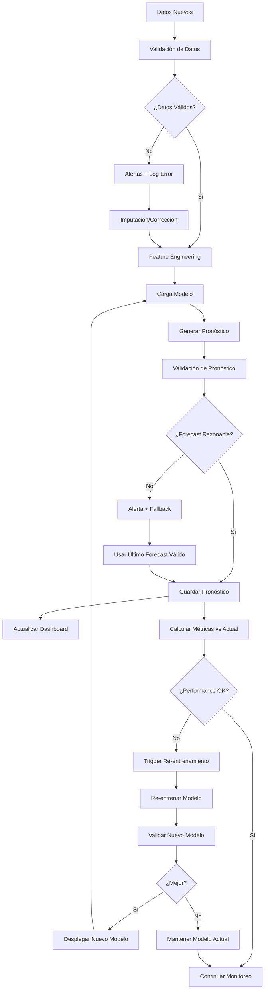

```mermaid
graph TD
    A[Datos Nuevos] --> B[Validación de Datos]
    B --> C{¿Datos Válidos?}
    C -->|No| D[Alertas + Log Error]
    C -->|Sí| E[Feature Engineering]
    E --> F[Carga Modelo]
    F --> G[Generar Pronóstico]
    G --> H[Validación de Pronóstico]
    H --> I{¿Forecast Razonable?}
    I -->|No| J[Alerta + Fallback]
    I -->|Sí| K[Guardar Pronóstico]
    K --> L[Actualizar Dashboard]
    K --> M[Calcular Métricas vs Actual]
    M --> N{¿Performance OK?}
    N -->|No| O[Trigger Re-entrenamiento]
    N -->|Sí| P[Continuar Monitoreo]
    O --> Q[Re-entrenar Modelo]
    Q --> R[Validar Nuevo Modelo]
    R --> S{¿Mejor?}
    S -->|Sí| T[Desplegar Nuevo Modelo]
    S -->|No| U[Mantener Modelo Actual]
    T --> F
    U --> P
    D --> V[Imputación/Corrección]
    V --> E
    J --> W[Usar Último Forecast Válido]
    W --> K
```